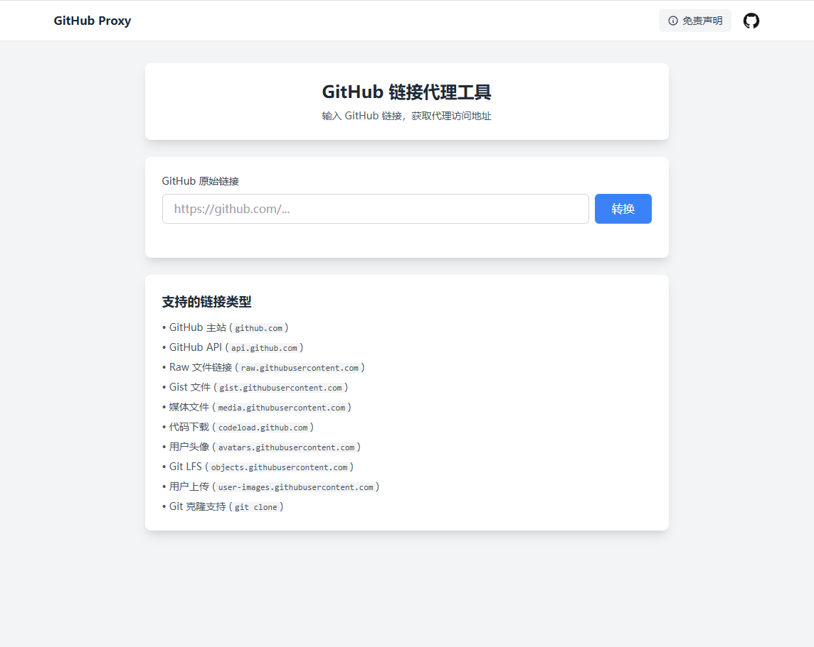

# GitHub Proxy

基于 Cloudflare Workers 的 GitHub 资源代理服务。

## 部署方法

1. 登录到 [Cloudflare Workers](https://workers.cloudflare.com)
2. 创建新的 Worker
3. 将 `worker.js` 的代码复制到 Worker 编辑器中
4. 保存并部署
5. 配置自定义域名（可选）

## 演示

## 注意事项

- 本代理服务仅供学习研究使用
- 请遵守 GitHub 的使用条款和政策
- 不建议用于大规模的生产环境
- 如遇到访问限制，请适当降低请求频率

## 许可证

MIT License
